# RxGuard System Architecture

> Computer Vision-Based Electronic Health Record System for Medical Record Digitization

---

## Table of Contents

- [1. System Overview](#1-system-overview)
- [2. Infrastructure Topology](#2-infrastructure-topology)
- [3. Authentication & Authorization](#3-authentication--authorization)
- [4. Medical Record Upload & OCR Pipeline](#4-medical-record-upload--ocr-pipeline)
- [5. Deduplication System](#5-deduplication-system)
- [6. Hybrid OCR Engine](#6-hybrid-ocr-engine)
- [7. Consent Management](#7-consent-management)
- [8. Pharmacist Verification Flow](#8-pharmacist-verification-flow)
- [9. Notification System](#9-notification-system)
- [10. Data Model](#10-data-model)
- [11. Environment Configuration](#11-environment-configuration)

---

## 1. System Overview

RxGuard is a multi-service EHR platform that digitizes physical medical records using OCR, enforces consent-based pharmacist access under RA 10173 (Data Privacy Act of 2012), prevents duplicate uploads via perceptual hashing, and auto-generates patient digital ID cards.

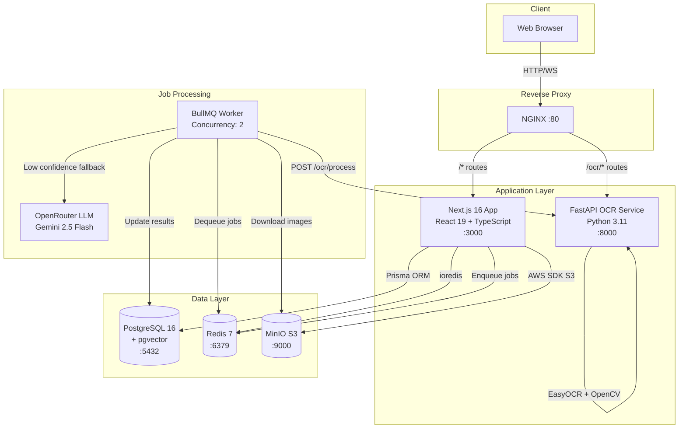

### Tech Stack Summary

| Layer | Technology |
|-------|-----------|
| Frontend + API | Next.js 16 (App Router), React 19, TypeScript 5, Tailwind CSS v4, ShadCN v4 |
| Auth | NextAuth v5 (Credentials provider), JWT sessions, 5 roles |
| ORM | Prisma v7 with `@prisma/adapter-pg`, PostgreSQL 16 + pgvector |
| OCR Microservice | Python FastAPI, OpenCV, EasyOCR |
| LLM Fallback | OpenRouter API + Vercel AI SDK `generateObject` |
| Job Queue | BullMQ v5 + Redis 7 (ioredis) |
| Object Storage | MinIO (S3-compatible) via `@aws-sdk/client-s3` |
| PDF Generation | `@react-pdf/renderer` v4 |
| Validation | Zod v4, react-hook-form v7 |

---

## 2. Infrastructure Topology

### Docker Services

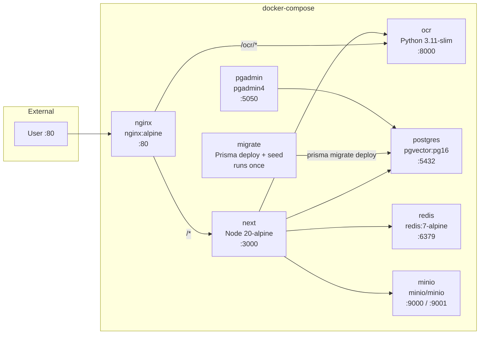

### Service Startup Order

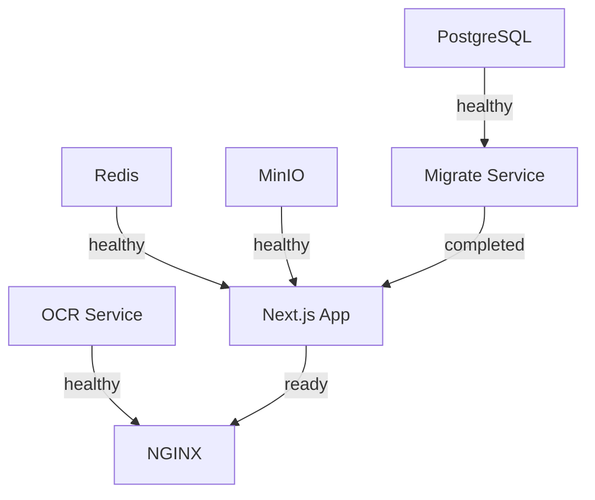

**Production** (`docker-compose.prod.yml`):
- Adds explicit `migrate` service that runs `prisma migrate deploy && seed` before Next.js starts
- No pgAdmin service
- All health-check gated

**Development** (`docker-compose.dev.yml`):
- Volume mounts for hot reload on Next.js and OCR source
- All ports exposed to host (3000, 8000, 5432, 6379, 9000, 9001, 5050)
- OCR runs with `--reload`

### NGINX Routing

| Path | Upstream | Timeout |
|------|----------|---------|
| `/ocr/*` | `ocr:8000` | 60s |
| `/*` | `next:3000` | default |

WebSocket upgrade headers are forwarded for Next.js HMR in development.

---

## 3. Authentication & Authorization

### Login Flow

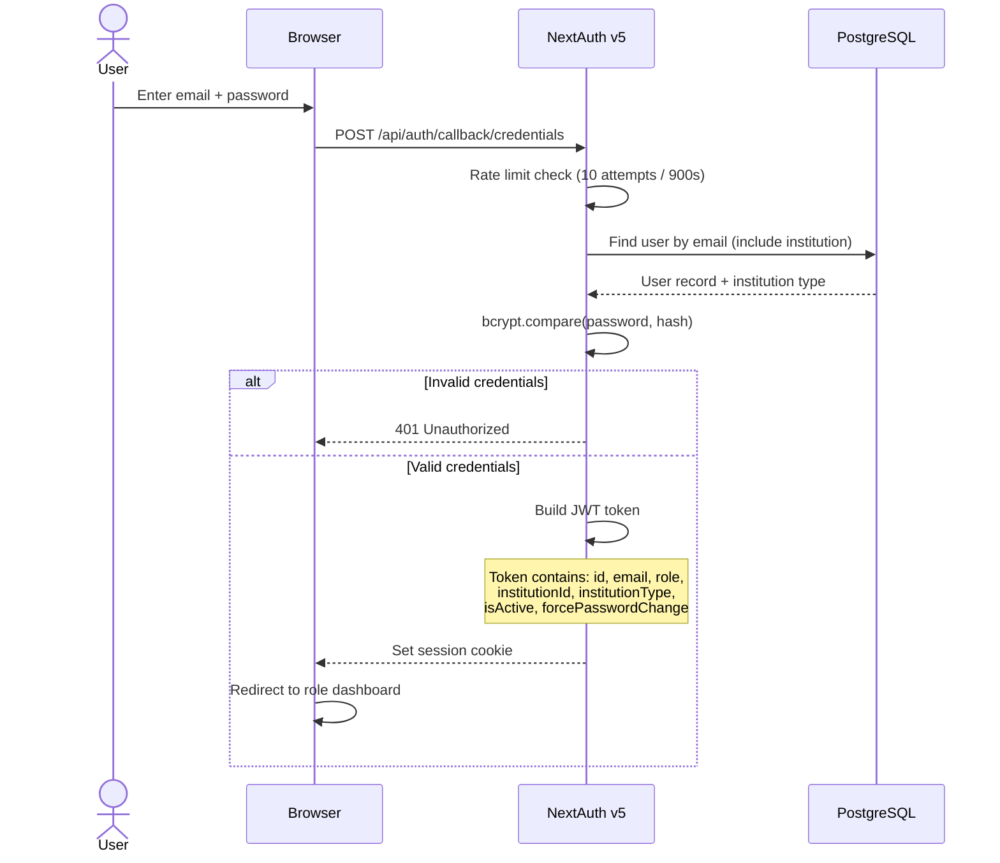

### Session Structure

```typescript
interface Session {
  user: {
    id: string               // User UUID
    email: string
    role: UserRole           // superadmin | admin | doctor | pharmacist | patient
    institutionId: string    // Hospital or pharmacy UUID (nullable)
    institutionType: string  // hospital | pharmacy (nullable)
    isActive: boolean
    forcePasswordChange: boolean
  }
}
```

### Middleware Route Protection

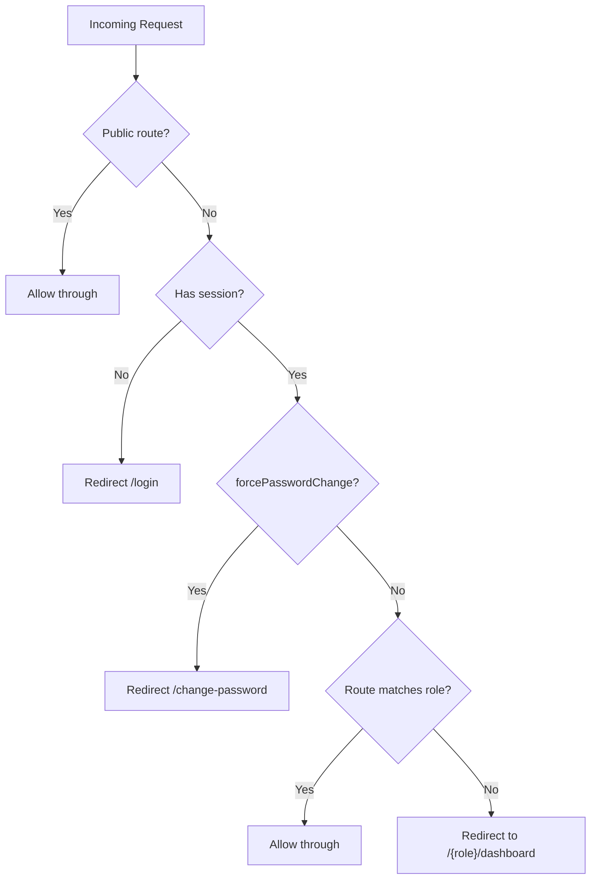

**Public routes** (no auth required):
`/login`, `/forgot-password`, `/reset-password`, `/api/auth/*`, `/api/health`, `/verify`, `/api/verify`

### Role-Based Access Matrix

| Role | Dashboard | Manages | Special Access |
|------|-----------|---------|----------------|
| **Superadmin** | `/superadmin/dashboard` | Institutions, all users | System-wide |
| **Admin** | `/admin/dashboard` | Doctors or pharmacists (by institution type) | Consent approvals, audit logs |
| **Doctor** | `/doctor/dashboard` | Patients, records | Upload, OCR review, signing |
| **Pharmacist** | `/pharmacist/dashboard` | Verifications | Consent-gated patient access |
| **Patient** | `/patient/dashboard` | Own consents | View own records, ID card |

---

## 4. Medical Record Upload & OCR Pipeline

### End-to-End Flow

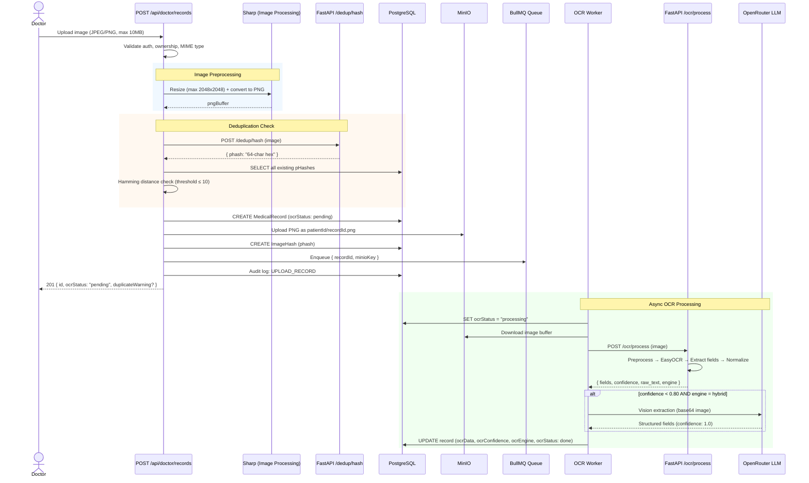

### Upload Endpoint Details

**`POST /api/doctor/records`**

| Step | Action | Details |
|------|--------|---------|
| 1 | Auth check | Doctor role, owns patient record |
| 2 | File validation | JPEG/PNG only, max 10 MB |
| 3 | Image resize | Sharp: max 2048x2048, convert to PNG |
| 4 | pHash compute | POST to `/dedup/hash` endpoint |
| 5 | Duplicate check | Hamming distance against all existing hashes |
| 6 | DB record create | `ocrStatus: pending` |
| 7 | MinIO upload | Key: `{patientId}/{recordId}.png` |
| 8 | Hash store | `ImageHash` table with phash |
| 9 | Job enqueue | BullMQ `ocr-processing` queue |
| 10 | Audit log | `UPLOAD_RECORD` with IP address |

### BullMQ Worker Configuration

| Setting | Value |
|---------|-------|
| Queue name | `ocr-processing` |
| Concurrency | 2 jobs |
| Lock duration | 120 seconds |
| Max attempts | 3 |
| Backoff | Exponential, 2s initial |
| Completed retention | Last 100 |
| Failed retention | Last 500 |

Worker initialization happens during Next.js instrumentation (`src/instrumentation.ts`), which runs only in the Node.js runtime (not Edge).

### Error Handling & Retries

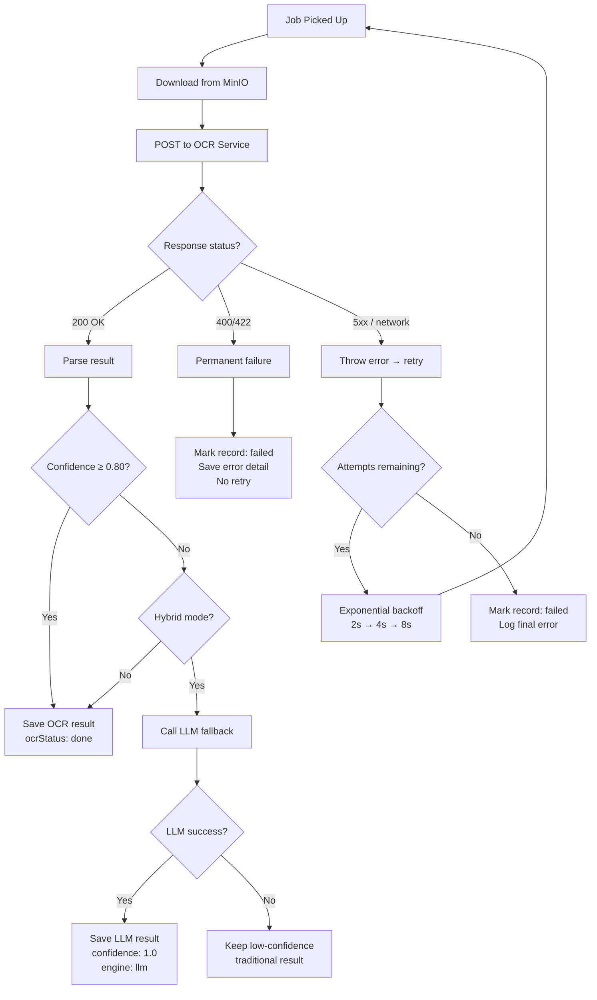

---

## 5. Deduplication System

### Perceptual Hash (pHash) Pipeline

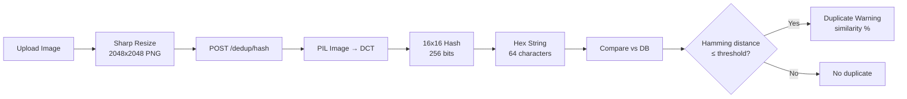

### How It Works

1. **Hash computation**: The uploaded image is sent to the FastAPI `/dedup/hash` endpoint, which uses the `imagehash` library to compute a DCT-based perceptual hash (16x16 = 256 bits, stored as 64-character hex string).

2. **Comparison**: The JavaScript upload handler queries all existing `ImageHash` records and computes the Hamming distance (count of differing bits) between the new hash and each stored hash.

3. **Decision**: If the Hamming distance is ≤ `PHASH_THRESHOLD` (default: 10), a duplicate warning is generated with a similarity percentage. The upload continues regardless — this is a **warning-only** feature.

### Hamming Distance Implementation

```
distance = 0
for each hex digit pair (new, existing):
    XOR the digits
    count set bits in result
    add to distance

similarity = (1 - distance / 64) * 100%
```

| Distance | Interpretation |
|----------|----------------|
| 0 | Identical images |
| 1–10 | Very similar (compression, minor rotation) |
| 11–20 | Somewhat similar |
| > 20 | Different documents |

### Storage

The `ImageHash` table also includes an `embedding VECTOR(512)` column (pgvector) prepared for future ViT-based semantic deduplication, with an IVFFLAT index ready for fast vector search.

---

## 6. Hybrid OCR Engine

### Processing Pipeline (FastAPI Service)

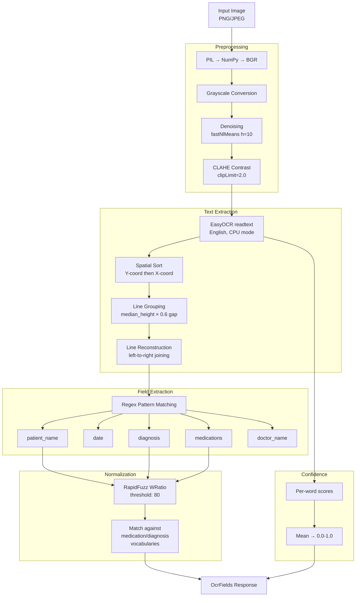

### OCR Field Extraction Patterns

| Field | Regex Pattern | Fallback |
|-------|--------------|----------|
| Patient Name | `(?:patient\s*(?:name)?|name\s*of\s*patient|pt|px)\s*[:\-.]?\s*(.*)` | Next line if noise |
| Date | Multiple formats: ISO, US slash, dashed, text month | — |
| Diagnosis | `(?:diagnosis|dx|impression|assessment)\s*[:\-]?\s*(.*)` | Next line if noise |
| Doctor Name | `(?:physician|doctor|attending|prescribed\s*by)\s*[:\-.]?\s*(.*)` | `Dr. + Name` pattern |
| Medications | Dosage pattern: `(\d+)\s*(mg|mcg|ml|g|tabs?|...)` per line | — |

### OCR Digit Correction

Near dosage units (mg, mcg, ml, g), common OCR misreads are auto-corrected:
- `O` → `0`, `I` → `1`, `l` → `1`
- Example: `"lOmg"` becomes `"10mg"`

### Hybrid Decision Tree

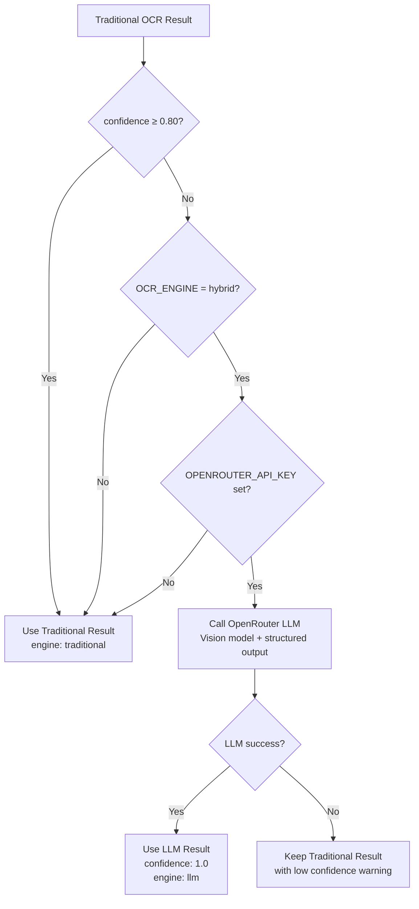

**LLM Fallback Details:**
- Provider: OpenRouter
- Default model: `google/gemini-2.5-flash`
- Method: `generateObject()` with Zod schema validation
- Input: base64-encoded PNG as vision data URL
- Output: schema-validated `MedicalRecordFields` object

---

## 7. Consent Management

### Consent Lifecycle

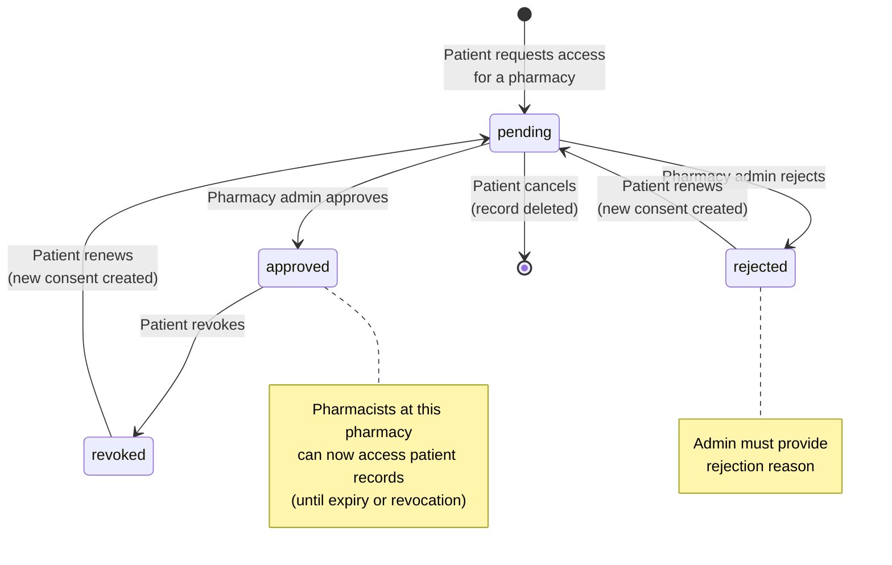

### Consent Request Flow

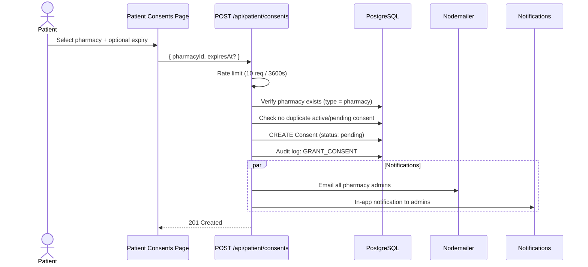

### Consent Approval Flow

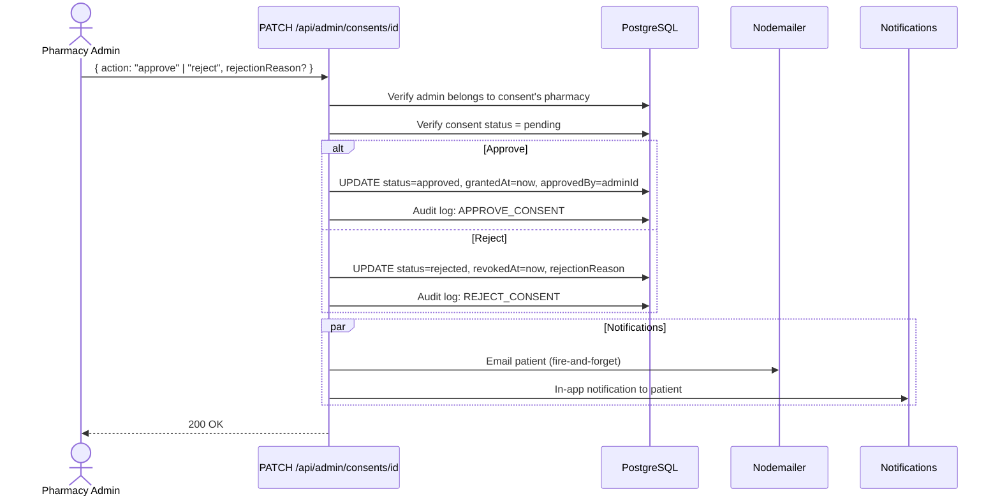

### Consent Validation (Access Gate)

Every pharmacist access to patient data goes through a consent gate:

```typescript
// src/lib/consent-gate.ts
async function requireConsent(patientId, pharmacyId) {
  // 1. Find approved consent for patient-pharmacy pair
  // 2. Check expiration (expiresAt < now → 403)
  // 3. Throw ConsentError(403) if not found
}
```

---

## 8. Pharmacist Verification Flow

### End-to-End Pharmacist Workflow

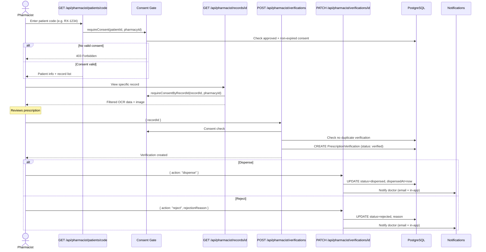

### Verification States

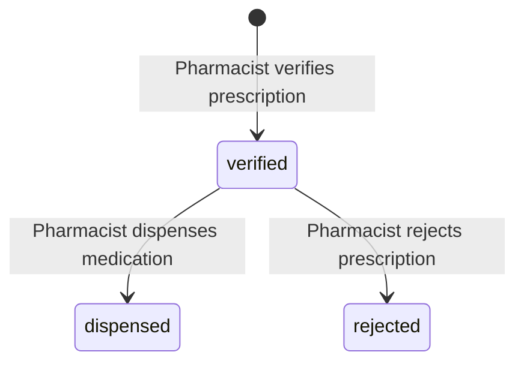

### Data Filtering for Pharmacists

Pharmacists receive a **filtered view** of medical records. Only these fields are exposed:

| Field | Visible | Reason |
|-------|---------|--------|
| `medications` | Yes | Required for dispensing |
| `doctor_name` | Yes | Verify prescriber |
| `date` | Yes | Check recency |
| `record_type` | Yes | Context |
| `patient_name` | No | Available from patient profile |
| `diagnosis` | No | Not needed for dispensing |
| `raw_text` | No | Sensitive |

---

## 9. Notification System

### Notification Architecture

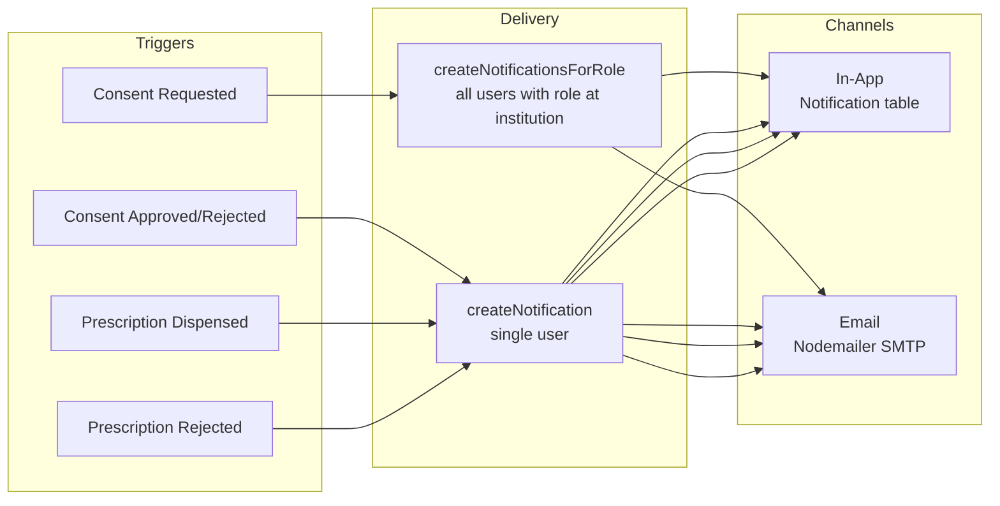

### Notification Types

| Type | Recipient | Trigger |
|------|-----------|---------|
| `CONSENT_REQUESTED` | Pharmacy admins | Patient requests consent |
| `CONSENT_APPROVED` | Patient | Admin approves consent |
| `CONSENT_REJECTED` | Patient | Admin rejects consent |
| `PRESCRIPTION_DISPENSED` | Doctor (uploader) | Pharmacist dispenses |
| `PRESCRIPTION_REJECTED` | Doctor (uploader) | Pharmacist rejects |
| `WELCOME` | New user | Account creation |

### API Endpoints

| Method | Endpoint | Action |
|--------|----------|--------|
| `GET` | `/api/notifications` | List all (max 50) + unread count |
| `PATCH` | `/api/notifications/{id}` | Mark single as read |
| `POST` | `/api/notifications` | `{ action: "mark-all-read" }` |

---

## 10. Data Model

### Entity Relationship Diagram

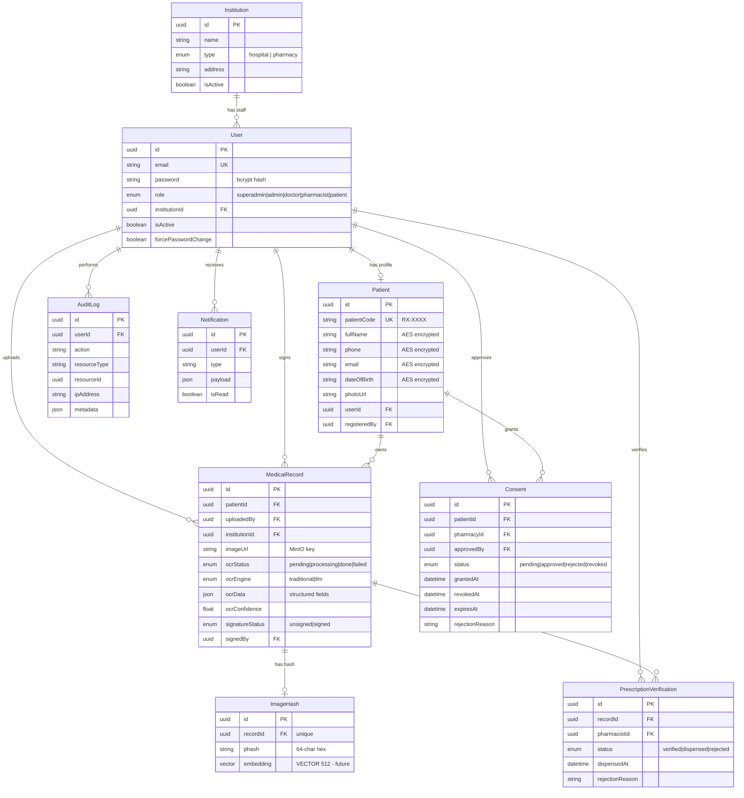

### Key Enums

```
UserRole:           superadmin | admin | doctor | pharmacist | patient
InstitutionType:    hospital | pharmacy
OcrStatus:          pending | processing | done | failed
OcrEngine:          traditional | llm
SignatureStatus:    unsigned | signed
ConsentStatus:      pending | approved | rejected | revoked
VerificationStatus: verified | dispensed | rejected
```

### Data Encryption

Patient PII fields (`fullName`, `phone`, `email`, `dateOfBirth`) are encrypted at rest using AES-256 with the `ENCRYPTION_KEY` environment variable (64 hex chars = 32 bytes). Decryption happens at the application layer when data is read.

---

## 11. Environment Configuration

### Database & Storage

| Variable | Default | Description |
|----------|---------|-------------|
| `DATABASE_URL` | — | PostgreSQL connection string |
| `REDIS_URL` | `redis://localhost:6379` | Redis for BullMQ job queue |
| `MINIO_ENDPOINT` | `localhost` / `minio` | MinIO S3 host |
| `MINIO_PORT` | `9000` | MinIO API port |
| `MINIO_ACCESS_KEY` | — | S3 access key |
| `MINIO_SECRET_KEY` | — | S3 secret key |
| `MINIO_BUCKET_RECORDS` | `medical-records` | Medical record images bucket |
| `MINIO_BUCKET_IDCARDS` | `id-cards` | Patient ID card images bucket |

### Authentication

| Variable | Default | Description |
|----------|---------|-------------|
| `AUTH_SECRET` | — | NextAuth JWT signing key (32+ chars) |
| `AUTH_TRUST_HOST` | — | Trust proxy headers |
| `AUTH_URL` | `http://localhost:3000` | Canonical app URL |
| `ENCRYPTION_KEY` | — | AES-256 key (64 hex chars) |

### OCR Service

| Variable | Default | Description |
|----------|---------|-------------|
| `OCR_SERVICE_URL` | `http://localhost:8000` | FastAPI OCR endpoint |
| `OCR_ENGINE` | `hybrid` | Mode: `traditional` / `llm` / `hybrid` |
| `OCR_CONFIDENCE_THRESHOLD` | `0.80` | LLM fallback trigger threshold |
| `PHASH_THRESHOLD` | `10` | Hamming distance for duplicate detection |
| `SEMANTIC_THRESHOLD` | `0.85` | Semantic matching threshold |
| `OPENROUTER_API_KEY` | — | OpenRouter API key (empty = LLM disabled) |
| `OPENROUTER_MODEL` | `google/gemini-2.5-flash` | LLM vision model |

### Email

| Variable | Default | Description |
|----------|---------|-------------|
| `SMTP_HOST` | `smtp.gmail.com` | Mail server |
| `SMTP_PORT` | `587` | SMTP port |
| `SMTP_USER` | — | SMTP username |
| `SMTP_PASS` | — | SMTP password |
| `EMAIL_FROM` | `noreply@rxguard.local` | Sender address |

### Network Configuration (Docker)

| Context | OCR URL | Redis URL | MinIO Endpoint |
|---------|---------|-----------|----------------|
| Local dev | `http://localhost:8000` | `redis://localhost:6379` | `localhost` |
| Docker internal | `http://ocr:8000` | `redis://redis:6379` | `minio` |
